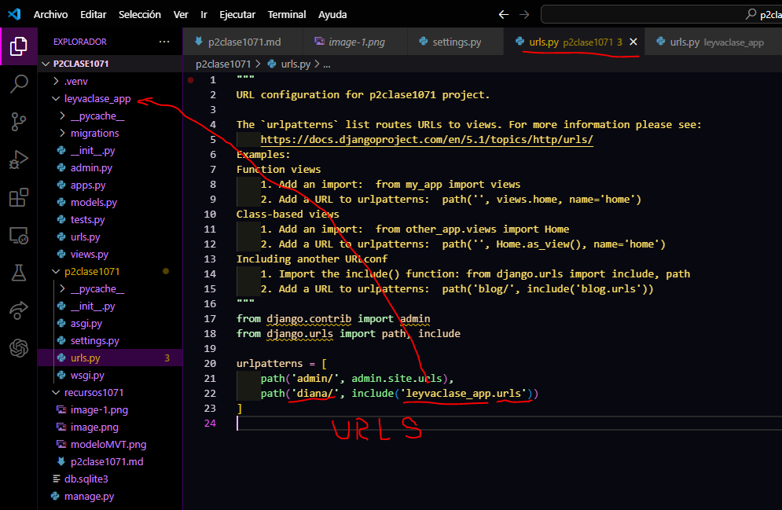

- crear aplicacion leyvaclase_app
- comando --> python manage.py startapp leyvaclase_app
- creamos el archivo urls.py en leyvaclase_app
- 
- en setting.py de p2clase1071
- 
- en urls.py de p2clase1071
- 
- en urls.py en leyvaclase_app
- 
- en views.py en leyvaclase_app
- 
- en urls.py de leyvaclase_app
- 